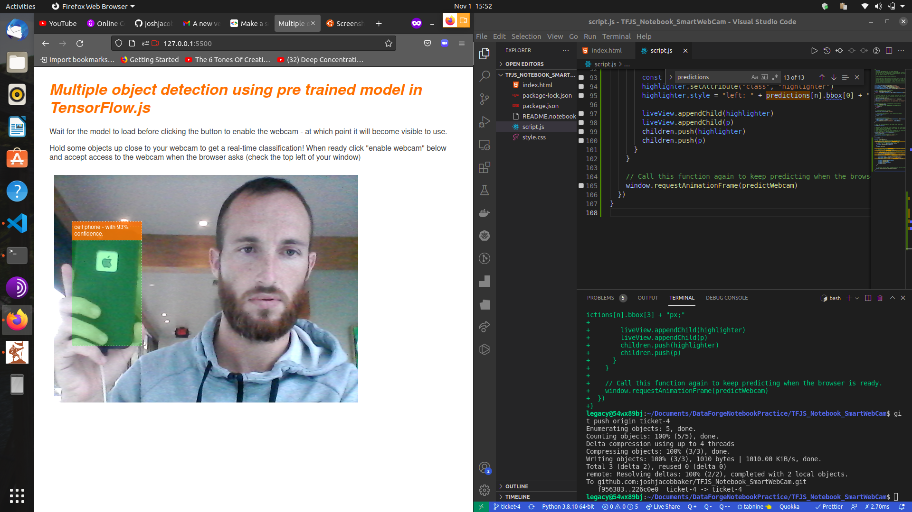
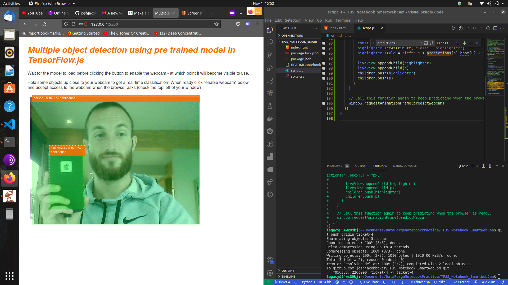

# TFJS ML Model Tutorial

In this tutorial we put together a website, access to the web camera, and a machine learning model that detects objects in the camera with probability and classification.

Link to tutorial guide: [Codelab TFJS](https://codelabs.developers.google.com/codelabs/tensorflowjs-object-detection?hl=en&continue=https%3A%2F%2Fcodelabs.developers.google.com%2F#8)

